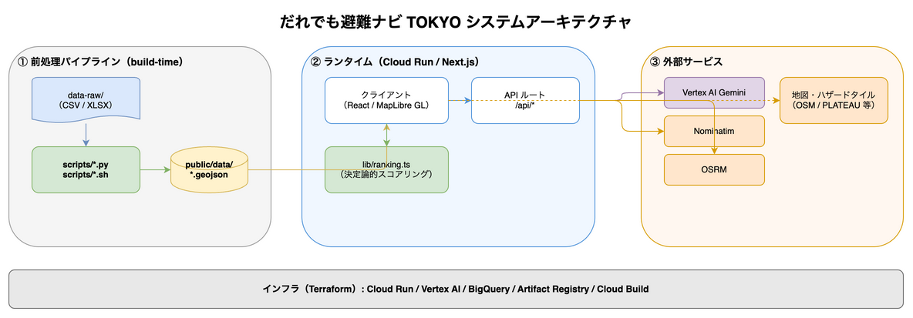

# アーキテクチャ / Architecture

だれでも避難ナビ TOKYO のシステム構成。データ流れは **CSV/XLSX → preprocess → GeoJSON → 決定論的スコアリング(ranking) → 地図** が背骨。



> 図の編集ソースは [`docs/architecture.drawio`](docs/architecture.drawio)（draw.io で開くと編集可能。PNGにもXMLを埋め込み済み）。

---

## 日本語

### ① 前処理パイプライン（build-time・ランタイム外）
避難時のリアルタイム処理を軽くするため、重い加工は**事前バッチ**で済ませ、成果物(GeoJSON)をリポジトリに同梱して Cloud Run へデプロイする。

- **`scripts/preprocess.py`**: 東京都オープンデータのCSV(避難所/避難場所/車椅子対応トイレ/給水・Wi-Fi/都営バスGTFS/住基年齢別人口/「だれでも東京」/都立一時滞在施設XLSX)を、エンコーディング自動判定のうえ正規化・バリアフリー列/災害種別のbool化を行い、`public/data/*.geojson` と `public/data/metadata.json` を生成。
- **`scripts/aging_bq.sh`**: e-Stat 国勢調査 小地域の年齢別人口×境界を、**BigQuery GIS の `ST_CONTAINS`** で避難所点と空間結合し、町丁目粒度の高齢化率 `data/chome_aging.json`(中間生成物)を出力。`preprocess.py` が evacuation.geojson に焼き込む。
- **`scripts/flood_grid.py`**: 浸水予想区域図(流域別・計100MB超)を約278mグリッドに集約し `public/data/flood_grid.json` を生成。
- **国土地理院 住所検索API**: 座標を持たない都立一時滞在施設の住所をジオコーディング（結果はキャッシュ）。

### ② ランタイム（GCP Cloud Run / Next.js 16）
- **クライアント（React 19 / MapLibre GL JS）**: `/data/*.geojson` を読み込み、`lib/ranking.ts` で**決定論的にスコアリング**（`基準点 ± 距離 ± 災害種別適否 ± バリアフリー適合 ± 状況補正`）。`lib/floodRoute.ts` が推奨避難所への経路の浸水曝露を判定。結果・経路・各レイヤを地図へ描画。
- **API ルート（Next server / Node runtime・IP単位レート制限）**:
  - `/api/triage`・`/api/timeline` … 自然文→11配慮属性/避難タイムラインを **Vertex AI Gemini** で抽出・生成（構造化出力＋zod検証）。
  - `/api/geocode` … Nominatim へ住所検索。
  - `/api/route`・`/api/walkroute` … OSRM へ徒歩経路。
- **フォールバック**: LLMの認証無/例外/検証失敗、およびオフライン時は**語句一致抽出**（`lib/triageFallback.ts`）で動作継続（詳細は [docs/llm-rationale.md](docs/llm-rationale.md)）。

### ③ 外部サービス（第三者・公開エンドポイント）
- LLM: Vertex AI Gemini（`gemini-2.5-flash`・IAM認証）
- ジオコーディング: Nominatim / 徒歩経路: OSRM
- タイル(クライアント直): OSM地図 / 国交省ハザード / AWS Terrarium DEM / PLATEAU建物MVT
- ⚠️ OSM/OSRM/Nominatim/PLATEAU等は公開・デモ依存。**本番公開時は自前ホスティング化が必要**（[issue #21](https://github.com/muroshima/Hinan-Navi-Tokyo/issues/21)）。

### インフラ
**Terraform（GCS backend）** で Cloud Run / Vertex AI / Artifact Registry / Cloud Build / BigQuery を管理。Cloud Build でコンテナをビルド→Artifact Registry→**Cloud Run（min-instances=0）** にデプロイ。BigQuery は前処理(空間結合)のみに使用。詳細は [`infra/terraform/`](infra/terraform/)。

### 運用: コスト停止・再開（提出後のコスト戦略）
Cloud Run は **min-instances=0** でアイドル時は無課金だが、提出後にライブデモを止める/再開する手順を明記する（ハッカソン提出物・イメージ・データは残す）。

- **停止**（サービスと公開IAMだけ削除・課金停止）:
  ```bash
  cd infra/terraform && terraform apply -var run_image=""
  ```
  `run_image=""` で Cloud Run の `count` が 0 になり、サービス＋公開IAMが destroy される（イメージ(Artifact Registry)・BigQuery・その他リソースは残る）。
- **再開**（同じURLで復活。`TAG` は Artifact Registry の実タグに置換）:
  ```bash
  cd infra/terraform && terraform apply -var 'run_image=asia-northeast1-docker.pkg.dev/hinan-navi-tokyo/app/hinan-navi:TAG'
  ```
- **新ビルドのデプロイ**: `gcloud builds submit --tag 'asia-northeast1-docker.pkg.dev/hinan-navi-tokyo/app/hinan-navi:NEW_TAG' .` → 上記 apply の `TAG` に `NEW_TAG` を渡す。
- **予算の防波堤**: Vertex AI / GCP 側で**予算アラート・クォータ**を設定し、LLM/APIのコスト暴発を防ぐ（[#69](https://github.com/muroshima/Hinan-Navi-Tokyo/issues/69)）。LLMは IP単位レート制限＋10分キャッシュでも抑制済み（[#30](https://github.com/muroshima/Hinan-Navi-Tokyo/issues/30)）。
- ⚠️ `terraform apply` を `-var run_image` 無しで実行すると既定イメージで**再デプロイ**される（削除ではない。[#72](https://github.com/muroshima/Hinan-Navi-Tokyo/issues/72) の地雷対策）。**停止したい時は必ず `-var run_image=""` を明示**する。

### 設計上のポイント
- **LLMは抽出だけ**に使い、避難先の順位付けは決定論的で**説明可能・再現可能**（点数内訳を提示）。
- 重い地理処理は**前処理に寄せて**ランタイムを軽量に保つ（Cloud Run min=0 でコスト最小）。
- 外部・LLM障害でも**フォールバックで止まらない**（命に関わるため）。

---

## English (summary)

**だれでも避難ナビ TOKYO** re-ranks evacuation shelters for people who need assistance. Data flow: **CSV/XLSX → preprocess → GeoJSON → deterministic scoring → map**.

- **① Preprocess (build-time)**: `scripts/preprocess.py` normalizes Tokyo open-data CSVs into `public/data/*.geojson`. `scripts/aging_bq.sh` computes chome-level aging rates via **BigQuery GIS `ST_CONTAINS`**. `scripts/flood_grid.py` aggregates flood-depth data into a compact grid. GSI API geocodes address-only datasets.
- **② Runtime (Cloud Run / Next.js 16)**: The client (React / MapLibre) loads GeoJSON and ranks shelters **deterministically** (`lib/ranking.ts`); `lib/floodRoute.ts` flags flood exposure of the route. API routes call **Vertex AI Gemini** (`/api/triage`, `/api/timeline`), Nominatim (`/api/geocode`), and OSRM (`/api/route`, `/api/walkroute`), with keyword fallback when the LLM or network is unavailable.
- **③ External services**: Vertex AI Gemini, Nominatim, OSRM, and map tiles (OSM / MLIT hazard / AWS Terrarium DEM / PLATEAU). These are public/demo endpoints that must be self-hosted before production (issue #21).
- **Infra**: Managed by **Terraform** (GCS backend): Cloud Run, Vertex AI, Artifact Registry, Cloud Build, BigQuery.

Design principles: the LLM is used **only for extraction** (ranking stays deterministic and explainable); heavy geo-processing is pushed to **build-time** to keep the runtime light (Cloud Run min-instances=0); and **fallbacks keep the app working** even when external services fail — critical for a life-safety tool.
