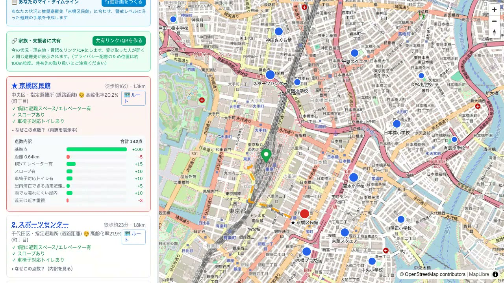

# だれでも避難ナビ TOKYO

ことばで状況を伝えると、**要配慮者が「本当に行ける」避難所**を提案する防災ナビ。東京都オープンデータを活用（都知事杯オープンデータ・ハッカソン向けプロトタイプ）。

自然文（例: 「雨の日、車椅子の母と避難したい」）から配慮属性（車椅子/高齢/乳幼児/視覚・聴覚障害/外国語/介助者/オストメイト/重度介護/夜間/天候/想定災害）を抽出し、避難所・避難場所を **バリアフリー × ハザード × 距離 × 当事者要件** で再ランキングします。

## 🌐 ライブデモ
https://hinan-navi-sceyw5h4sq-an.a.run.app

（Google Cloud Run 上で稼働。インフラは Terraform で管理 → [infra/terraform/](infra/terraform/)。デモ提供期間は限定される場合があります）

## 🎬 デモ動画（約60秒）
自然文入力 → 配慮属性の抽出 → 「行ける順」再ランキング → **なぜ1位かを点数の内訳で説明** → 洪水ハザード＋建物3D（垂直避難先）の重ね表示までを一気に紹介します。

[](docs/demo.mp4)

▶ サムネイルをクリックすると動画（[`docs/demo.mp4`](docs/demo.mp4)）が再生されます。収録パイプライン（Playwright 収録＋ナレーション合成）は [`scripts/demo/`](scripts/demo/) を参照。

## 📊 発表スライド
発表スライド（全12枚）: **[docs/slides.pdf](docs/slides.pdf)**（HTML版 [docs/slides.html](docs/slides.html)）。ソースは [docs/slides.md](docs/slides.md)（[Marp](https://marp.app/)）。

```bash
# ビルド（Marp CLI はリポジトリ依存に含めず npx で実行。テーマ・ローカル画像許可・
# 絵文字ネイティブ表示は marp.config.mjs に集約）
npx -y @marp-team/marp-cli@4.3.1 docs/slides.md -c marp.config.mjs -o docs/slides.html
npx -y @marp-team/marp-cli@4.3.1 docs/slides.md -c marp.config.mjs -o docs/slides.pdf --pdf
```

## 対象課題
**東京全域の、あらゆる要配慮者**（車椅子/高齢/乳幼児/視覚・聴覚障害/オストメイト/要介護/外国語…）が直面する「**最寄り ≠ 自分が本当に行ける避難先**」という普遍課題に、地域・災害種別を限定せず答えます。最も切実な代表ケースとして **江戸川区（江東5区）の大規模水害**（陸域の約7割がゼロメートル地帯・避難行動要支援者 約5,800人）も重視。詳細・出典は [docs/positioning.md](docs/positioning.md)。

### データ活用の核：単独データでは出せない「行ける順」
「その人が行ける順」は、どの単独オープンデータにも存在しません。ランキングのスコアは **避難先（避難所/避難場所）× 災害種別フラグ（避難場所に付与）× バリアフリー設備（施設属性＋近傍トイレ）× 当事者属性 × 直線距離** を掛け合わせて算出します（例: 洪水想定では「最寄り300mのA小学校（避難場所指定）＝災害種別フラグで洪水非対応・1階/EV情報なし」を降格し、「600m先で洪水対応・スロープ/車椅子トイレ有のB施設」を根拠付きで上位に）。さらに **ハザードタイル・高齢化率（町丁目）・建物高さ（垂直避難）・給水/Wi-Fi・OSRM実徒歩距離** を地図に重ねて意思決定を支援します（これらは文脈表示でスコアには入れません）。この**順位の逆転と根拠**が、掛け合わせでのみ生まれる新たな価値です。詳細は [docs/positioning.md](docs/positioning.md) の『データの掛け合わせで生まれる「行ける順」（データ活用の核）』節を参照。

## 主な機能
- 自然文 → 配慮属性の抽出（`/api/triage`。LLM構造化出力、APIキー無い場合は語句一致のフォールバック）
- 「その人が行ける順」の再ランキング ＋ 意思決定支援（なぜ1位か／より近いのに見送った理由）
- ハザードレイヤ重ね（国交省: 洪水/高潮/津波/土砂）、3D地形（坂・起伏）、PLATEAU建物3D（高さで垂直避難先を色分け・23区）
- トイレ設備の近傍紐づけ（おむつ替え/オストメイト/大型ベッド/非常用ボタン）
- 生活継続レイヤー（災害時給水ステーション／公衆Wi-Fi／都営バス停）の重ね表示
- 高齢化率を**町丁目粒度**で文脈表示（国勢調査小地域×避難所を BigQuery GIS で空間結合）、実経路距離（OSRM）、現在地手動入力（Nominatim）、Googleマップ徒歩ルート

## 技術スタック
Next.js 16 / React 19 / TypeScript / Tailwind CSS / MapLibre GL JS / **Google Cloud（Cloud Run・Vertex AI・BigQuery、Terraform管理）**

## AI活用（Vertex AI Gemini）
- **使用箇所**: `/api/triage`（自然文 → 11配慮属性＋想定災害の抽出）と `/api/timeline`（属性×災害×推奨避難先 → マイ・タイムライン生成）。
- **モデル/認証**: **Vertex AI Gemini（`gemini-2.5-flash`）** を `@google/genai` から呼び出し。**IAM認証（APIキー不要）**。構造化出力（responseSchema）＋ zod で型検証。
- **設計の筋**: AIは**「自然文→構造化」の抽出に限定**し、避難先の順位付けは決定論的スコアリング（`lib/ranking.ts`）で行う＝**説明可能・再現可能**。
- **止まらない設計**: 認証未設定/API障害/検証失敗/オフライン時は語句一致フォールバックへ自動切替（`source` で手段を明示）。前処理の高齢化率算出には **BigQuery GIS（`ST_CONTAINS`空間結合）** も使用。
- 詳細 → [docs/llm-rationale.md](docs/llm-rationale.md)。

## セットアップ
```bash
npm install

# データ生成（CSV → public/data/*.geojson）
#   data-raw/ に元CSVを配置した上で実行
#   （避難所/避難場所/車椅子対応トイレ/住民基本台帳 年齢別人口）
python3 scripts/preprocess.py

npm run dev   # http://localhost:3000
```
`public/data/evacuation.geojson` / `toilets.geojson` が生成されていれば、地図・ランキングは動作します。

## 環境変数（任意）
| 変数 | 用途 |
|---|---|
| `GOOGLE_CLOUD_PROJECT` | `/api/triage`・`/api/timeline` の LLM は **Vertex AI Gemini**（IAM認証・APIキー不要）。プロジェクトIDを設定。未設定なら語句一致のフォールバックで動作 |
| `GCP_LOCATION` | Vertex のロケーション（既定 `global`） |
| `NOMINATIM_CONTACT_EMAIL` | `/api/geocode` が Nominatim に付与する連絡先（任意・利用ポリシー対応。未設定でも動作） |

`.env.local.example` を参照。ローカルで Gemini を使う場合は `gcloud auth application-default login`（ADC）が必要です。未設定でもアプリは起動・動作します（LLM部分は語句一致fallback）。本番（Cloud Run）は SA の IAM で認証します。

## データ出典・ライセンス
各データ・タイル・APIの**出典/ライセンス/取得日/加工/利用規約上の留意点**は **[docs/DATA.md](docs/DATA.md)** に一覧（機械可読版は [`public/data/metadata.json`](public/data/metadata.json)）。要点:
- 東京都オープンデータ（避難所・避難場所一覧／車椅子対応トイレ バリアフリー情報／住民基本台帳 年齢別人口）— **CC BY 4.0**
- 国土交通省 ハザードマップポータルサイト（洪水/高潮/津波/土砂 タイル）— 出典表示が条件
- 地形: Mapzen / AWS Open Data（Terrarium DEM）、地図: © OpenStreetMap contributors（ODbL）
- ジオコーディング: Nominatim、徒歩経路: OSRM（**公開サーバは利用ポリシー上、本番常用に制限あり** → [docs/DATA.md](docs/DATA.md)参照）

> コード本体は [Apache-2.0](LICENSE)。データのライセンスとは別に扱います。

## 詳細ドキュメント
- [ARCHITECTURE.md](ARCHITECTURE.md) — **システム構成図**（CSV→preprocess→GeoJSON→ranking→map・GCP/Terraform・外部API）
- [docs/positioning.md](docs/positioning.md) — 課題設定・データ活用の核（単独データでは出せない「行ける順」）
- [docs/usecases.md](docs/usecases.md) — **命を守るユースケース集**（夜×視覚障害／乳幼児×荒天／車椅子×洪水 ほか）
- [docs/personas.md](docs/personas.md) — **当事者性とペルソナ**（一次情報に基づく想定ペルソナ・ヒアリング計画）
- [docs/llm-rationale.md](docs/llm-rationale.md) — **なぜ生成AIか**（抽出への限定・構造化出力＋zod・多層フォールバック）
- [docs/roadmap.md](docs/roadmap.md) — **社会実装ロードマップ**（自治体配布／福祉部局連携／データ更新継続・持続的提供）
- [docs/DATA.md](docs/DATA.md) — データ出典・ライセンス・再現手順

## 注意
本リポジトリはハッカソン用プロトタイプです。避難の最終判断は自治体の公式情報に従ってください。
