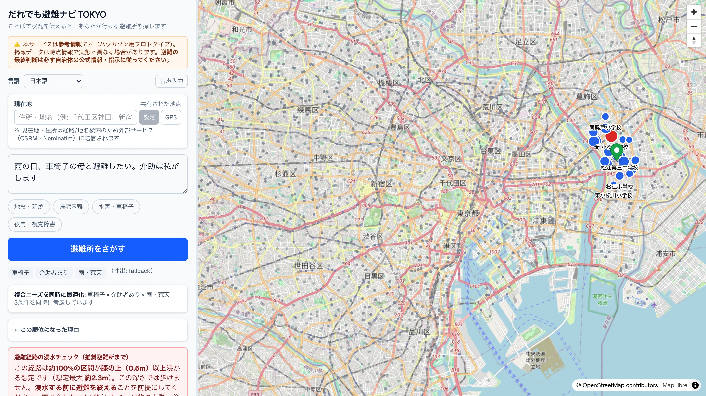

<!--
Marp スライド（HTML/PDF出力）。テーマ・ローカル画像許可・絵文字ネイティブ表示は marp.config.mjs に集約。
ビルド: marp docs/slides.md -c marp.config.mjs -o docs/slides.html
       marp docs/slides.md -c marp.config.mjs -o docs/slides.pdf --pdf
-->

<!-- _class: title -->
<!-- _paginate: false -->
<!-- _header: "" -->
<!-- _footer: "" -->

# だれでも避難ナビ TOKYO

### ことばで状況を伝えると、要配慮者が「**本当に行ける**」避難所を提案する防災ナビ

東京都オープンデータ活用 ／ 都知事杯オープンデータ・ハッカソン

🌐 ライブデモ・GitHub・60秒デモ動画あり

---

## 課題：最寄り ≠ 「自分が本当に行ける」避難先

多くの避難所案内は、**移動に制約のない人**を前提にしている。

- 🧑‍🦽 車椅子・高齢・乳幼児連れ・視覚/聴覚障害・オストメイト・要介護・外国語…
  → 「最寄り」が**段差・浸水域・夜間・設備なし**で「行けない」ことがある
- 🌊 災害は洪水・高潮・津波・土砂・地震で多様。**同じ避難所でも災害種別で適否が変わる**
- ❓ 結果、当事者は「**今いる場所から、本当に行ける避難先はどこか**」を平時に把握できない

> この壁は東京のどの地域・どの災害でも生じる**普遍的な課題**。

---

## だれの課題か：東京全域の、あらゆる要配慮者

地域・災害種別を**限定しない**汎用設計。そのうえで最も切実な代表ケースを重視。

### 対象
**東京全域 × 複数災害 × あらゆる配慮属性**
（避難所/避難場所 63市区町村、11の配慮属性）

### 最も切実な代表ケース
**江戸川区（江東5区）の大規模水害**
- 陸域の約7割が**ゼロメートル地帯**
- 江東5区で**約100万人**が2週間以上浸水域
- 区内に**避難行動要支援者 約5,800人**

出典: 江戸川区／内閣府 個別避難計画作成モデル事業 ほか

---

## ソリューション：ことばで相談 →「行ける順」

<b>① ことばで相談</b> 「雨の日、車椅子の母と避難したい。介助は私がします」

<b>② 配慮属性を抽出</b> 車椅子・介助者あり・雨/荒天・想定災害を構造化

<b>③「行ける順」に再ランキング</b> バリアフリー × ハザード × 距離 × 当事者要件

さらに **なぜ1位か／より近いのに見送った理由** を根拠付きで提示し、
**マイ・タイムライン**（警戒レベル準拠）まで返す。

---

## デモ：なぜ1位かを「点数の内訳」で説明

- **説明可能**：スコアを加減点の内訳で提示
  （基準点 +100／扉・EV有 +15／スロープ +15／車椅子トイレ +15…）
- **降格理由も明示**：「より近いA小は洪水非対応・段差のため見送り」
- 🎬 **60秒デモ動画**：入力→抽出→ランキング→根拠→ハザード/建物3D

▶ docs/demo.mp4（リポジトリ同梱）

---

## データ活用の核：単独データでは出せない「行ける順」

<b>「その人が行ける順」は、どの単独オープンデータにも存在しない。</b>掛け合わせで初めて立ち上がる。

| オープンデータ（単独） | 単独で分かる | 単独では**答えられない** |
|---|---|---|
| 避難所・避難場所一覧 | 位置・名称 | その人が**行けるか**／この災害で**使えるか** |
| 避難場所の災害種別フラグ | 災害別の適否 | 施設まで**バリアフリーに到達できるか** |
| 車椅子対応トイレ設備 | 設備の有無・場所 | それが**避難先の近傍か・この人に必要か** |
| ハザードマップ（国交省） | 危険エリア | どの避難先が危険で**どこが代替か** |
| PLATEAU 建物高さ | 建物の高さ | **水害時の垂直避難先**として適すか |

---

## 掛け合わせで初めて出る「順位の逆転と根拠」

**「車椅子の母と、洪水を想定」**

- 最寄り＝直線300mの **A小学校**
  → 災害種別フラグで**洪水非対応（−60）**
  → 1階/EV情報なし（−25）
- 600m先の **B施設**
  → **洪水対応（+25）** ・スロープ/車椅子トイレ有（+15/+10）

→ **「最寄り」ではなく B を根拠付きで上位に。**

score = Σ（基準点 ± 距離 ± 災害種別適否 ± バリアフリー適合 ± 状況補正）／`lib/ranking.ts`・決定論

---

## 使用オープンデータ

**東京都オープンデータ（CC BY 4.0）**
- 避難所・避難場所一覧
- 車椅子対応トイレ バリアフリー情報
- 住民基本台帳 年齢別人口
- 災害時給水ステーション／FREE Wi-Fi & TOKYO
- 「だれでも東京」施設情報／都立一時滞在施設
- 都営バス GTFS（交通局／ODPT）

**国 等**
- 国交省 ハザードマップ（洪水/高潮/津波/土砂）
- Project **PLATEAU** 建物3D（23区・CC BY 4.0）
- 国勢調査 小地域（高齢化率・BigQuery GIS 空間結合）
- 国土地理院 住所検索API（ジオコーディング）
- 地形: AWS Terrarium DEM／地図: OpenStreetMap

出典/ライセンス/取得日/加工は docs/DATA.md に一覧（機械可読版 metadata.json）

---

## 技術アーキテクチャ

CSV / XLSX東京都オープンデータ

→

preprocess正規化・空間結合

→

GeoJSON配信用データ

→

決定論 スコアリングranking

→

地図MapLibre

重い地理処理は<b>前処理へ寄せて</b>ランタイムを軽量化（Cloud Run min=0）。AIは<b>抽出だけ</b>・順位付けは<b>決定論</b>で説明可能。 技術: Next.js 16 / Google Cloud（Cloud Run・Vertex AI・BigQuery、Terraform管理）。

---

## サービスデザイン：当事者に寄り添う設計

- 🗣 **ことばで相談**（自然文・音声入力）
- 🧮 **根拠を返す**：なぜ1位か／行けない理由
- 🗺 **意思決定支援レイヤ**：ハザード・3D地形・**建物3D（垂直避難）**・給水/Wi-Fi
- 📋 **マイ・タイムライン**（警戒レベル準拠）

- 🌐 **多言語**：やさしい日本語・英語・中国語
- ♿ **アクセシビリティ**：色に頼らない区別・コントラスト是正・読み上げ
- 🛟 **止まらない設計**：AI障害/オフラインでも語句一致フォールバック
- ⚠️ **免責明示**：最終判断は自治体の公式情報へ

---

## 社会実装ロードマップ と 正直な限界

### ロードマップ
- **自治体配布**：区市町村単位のデータ差し替えで横展開
- **福祉部局連携**：個別避難計画の実務に接続
- **データ更新の継続**：オープンデータ更新に追従する前処理パイプライン

### 正直な限界
- 🟡 PLATEAU建物3D・都営バスは**23区中心**（多摩/島嶼は拡張課題）
- 福祉避難所の座標付き網羅データが都に存在せず**未統合**
- 公開タイル/経路は**本番向けに自前ホスティング化が必要**

---

<!-- _class: title -->
<!-- _paginate: false -->
<!-- _header: "" -->
<!-- _footer: "" -->

# だれも取り残さない避難へ

東京都のオープンデータの**掛け合わせ**だけで、
要配慮者に「**本当に行ける順**」と**その根拠**を届ける。

だれでも避難ナビ TOKYO ／ ライブデモ・GitHub・60秒デモ動画
