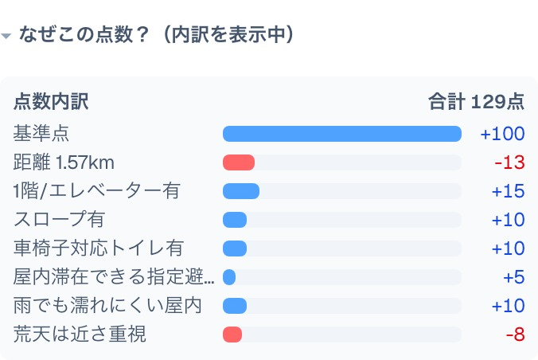
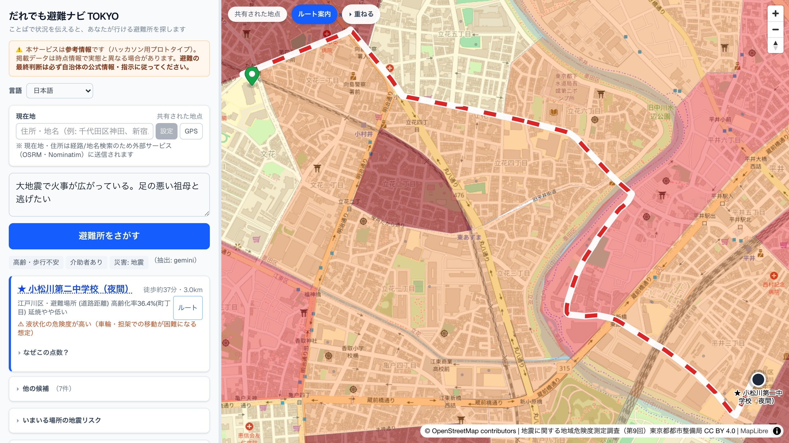
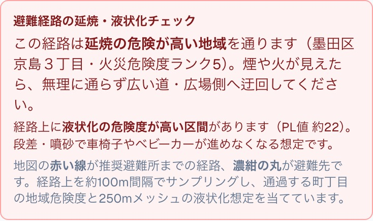
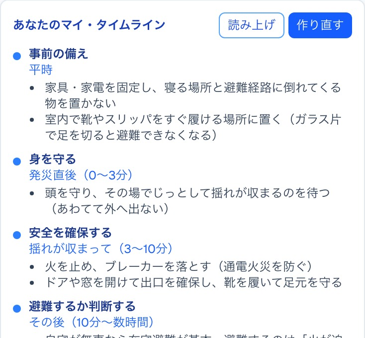
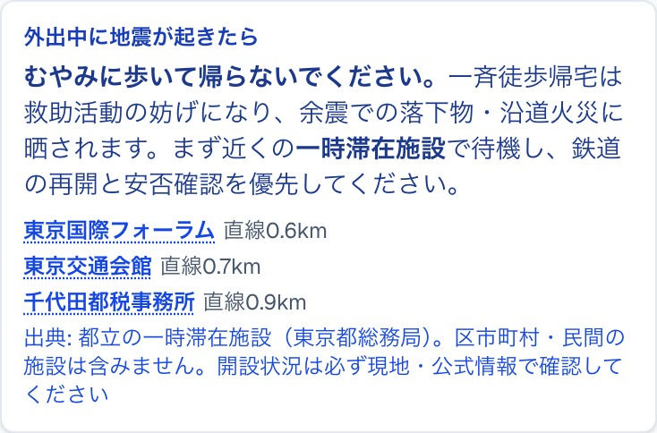

<!--
Marp スライド（HTML/PDF出力）。テーマ・ローカル画像許可・絵文字ネイティブ表示は marp.config.mjs に集約。
ビルド(Marp CLIは依存に含めずnpxで実行):
  npx -y @marp-team/marp-cli@4.3.1 docs/slides.md -c marp.config.mjs -o docs/slides.html
  npx -y @marp-team/marp-cli@4.3.1 docs/slides.md -c marp.config.mjs -o docs/slides.pdf --pdf
-->

<!-- _class: title -->
<!-- _paginate: false -->
<!-- _header: "" -->
<!-- _footer: "" -->

# だれでも避難ナビ TOKYO

### ことばで状況を伝えると、要配慮者が「**本当に行ける**」避難所を提案する防災ナビ

東京都オープンデータ活用 ／ 都知事杯オープンデータ・ハッカソン

🌐 ライブデモ・GitHub・1分デモ動画あり

---

## 課題：最寄り ≠ 「自分が本当に行ける」避難先

多くの避難所案内は、**移動に制約のない人**を前提にしている。

- 🧑‍🦽 車椅子・高齢・乳幼児連れ・視覚/聴覚障害・オストメイト・要介護・外国語…
  → 「最寄り」が**段差・浸水域・夜間・設備なし**で「行けない」ことがある
- 🌊 災害は洪水・高潮・津波・土砂・地震で多様。**同じ避難所でも災害種別で適否が変わる**
- ❓ 結果、当事者は「**今いる場所から、本当に行ける避難先はどこか**」を平時に把握できない

> この壁は東京のどの地域・どの災害でも生じる**普遍的な課題**。

---

## だれの課題か：東京全域の、あらゆる要配慮者

地域・災害種別を**限定しない**汎用設計。そのうえで最も切実な代表ケースを重視。

### 対象
**東京全域 × 複数災害 × あらゆる配慮属性**
（避難所/避難場所 63市区町村、12の配慮属性・状況）

### 最も切実な代表ケース
**江戸川区（江東5区）の大規模水害**
- 陸域の約7割が**ゼロメートル地帯**
- 浸水が2週間以上続く想定の区域に**約100万人**が居住
- 区内に**避難行動要支援者 約5,800人**

出典: 江戸川区／内閣府 個別避難計画作成モデル事業 ほか

---

## ソリューション：ことばで相談 →「行ける順」

**最初に地図は出さない。** 点が散らばった地図は判断材料にならないため、まず<b>ことばで伝える</b>ことに集中させる。地図とフィルタ条件は<b>相談したあとに現れる</b>。

<b>① ことばで相談</b> 「雨の日、車椅子の母と避難したい。介助は私がします」

<b>② 配慮属性を抽出</b> 車椅子・介助者あり・雨/荒天・想定災害を構造化

<b>③「行ける順」に 再ランキング</b> バリアフリー × 災害種別適否 × 距離 × 当事者要件

さらに **なぜ1位か／より近いのに見送った理由** を根拠付きで提示し、
**マイ・タイムライン**まで返す（気象災害は警戒レベル、**地震は発災起点**で組み替える）。

---

## 画面：なぜ1位かを「点数の内訳」で説明

- **説明可能**：スコアを加減点の内訳で提示
  （基準点 +100／1階・EV有 +15／スロープ +10／車椅子トイレ +10…）
- **降格理由も明示**：「より近いA小は洪水非対応・段差のため見送り」
- **結論が先**：はじめは畳んでおき、開くと根拠が出る。急いでいる人が最初に見るのは避難先の名前と距離
- **スマホでも同じ体験**：パネルは最小まで畳めて地図が画面の9割に。片手で開閉できる

---

## データ活用の核：単独データでは出せない「行ける順」

<b>「その人が行ける順」は、どの単独オープンデータにも存在しない。</b>掛け合わせで初めて立ち上がる。

| オープンデータ（単独） | 単独で分かる | 単独では**答えられない** |
|---|---|---|
| 避難所・避難場所一覧 | 位置・名称 | その人が**行けるか**／この災害で**使えるか** |
| 避難場所の災害種別フラグ | 災害別の適否 | 施設まで**バリアフリーに到達できるか** |
| 車椅子対応トイレ設備 | 設備の有無・場所 | それが**避難先の近傍か・この人に必要か** |
| ハザードマップ（国交省） | 危険エリア | どの避難先が危険で**どこが代替か** |
| PLATEAU 建物高さ | 建物の高さ | **水害時の垂直避難先**として適すか |

---

## 掛け合わせで初めて出る「順位の逆転と根拠」

**「車椅子の母と、洪水を想定」**

- 最寄り＝直線300mの **A小学校**
  → 災害種別フラグで**洪水非対応（−60）**
  → 1階/EV情報なし（−25）
- 600m先の **B施設**
  → **洪水対応（+25）** ・スロープ/車椅子トイレ有（+10/+10）

→ **「最寄り」ではなく B を根拠付きで上位に。**

※ A/B は説明用の簡略例（実データでの逆転はデモ動画 0:35〜）。score = Σ（基準点 ± 距離 ± 災害種別適否 ± バリアフリー適合 ± 状況補正）／`lib/ranking.ts`。**同じ入力なら必ず同じ結果**になる計算式

---

## 地震では、判断が水害と**逆になる**

<b>地震は予報が出ない。</b>警戒レベルという時間軸が、そもそも存在しない。

- 🔥 **延焼が迫るとき、屋内の避難所は正解ではない**
  → 屋外の**広域避難場所**へ向かうのが原則（水害と逆）
- 💧 **液状化した路面は、車輪も担架も通さない**
  → 同じ危険度でも、車椅子・要介護・乳幼児連れには**重み付けを変える**
- 🏢 **帰宅困難者が向かうべきは避難所ではない**
  → 指定避難所は自宅を失った人の受け皿。**一時滞在施設**で待機する

**使ったデータ（東京都・CC BY 4.0）**

- 地震に関する**地域危険度**測定調査（第9回）
  町丁目 **5,192件** ／ 建物倒壊・火災・総合のランク1〜5
- **首都直下地震**の被害想定（令和4年度）
  計測震度 **50mメッシュ 約69万件** ／ 液状化 PL値

> どちらも「危険な場所」を示すデータ。
> **「その人がどこへ逃げられるか」には、まだ誰も答えていない。**

---

## 画面：町丁目の危険度と、**経路**の延焼リスク

**避難先が安全か、だけでは足りない。**
**そこへ行き着けるか**を経路で判定する。

- 経路を約100m間隔で刻み、通過する町丁目の危険度を見る
- 「京島3丁目・**火災危険度ランク5**を通る」と地名で警告

---

## 地震：**発災起点**で行動計画を組み替える

**警戒レベルではなく、発災からの時間で刻む**

- 事前の備え → **0〜3分** → 3〜10分 → 数時間 → 数日
- 最初の行動は避難ではなく **その場で身を守ること**
  （車椅子ならブレーキと頭部保護、寝たきりなら枕で保護）
- 「自宅が無事なら在宅避難が基本」という**避難しない判断**も返す
- 単身で動けないなら **助けを呼ぶ**ことが正解になる場合も示す

現在地の危険度・想定震度・液状化を生成AIに渡すので、 「液状化で車輪が使えない前提で人手を確保」まで文面に入る。

---

## 地震：外出中なら、向かう先が変わる

**「職場にいるときに地震が起きた。電車が止まって帰れない」**

この一文から **外出中** を読み取り、案内先を切り替える。

- 指定避難所は**自宅を失った人**の受け皿
- 帰宅できないだけの人が向かうのは**一時滞在施設**
- 一斉徒歩帰宅は**救助活動を妨げ**、
  余震の落下物・沿道火災に晒される

> 「早く帰る」ではなく「**動かない**」が正解になる場面を、
> 平時のうちに知っておけるようにする。

---

## 使用オープンデータ

**東京都オープンデータ（CC BY 4.0）**
- 避難所・避難場所一覧
- 車椅子対応トイレ バリアフリー情報
- 住民基本台帳 年齢別人口
- 災害時給水ステーション／FREE Wi-Fi & TOKYO
- 「だれでも東京」施設情報／都立一時滞在施設
- 都営バス GTFS（交通局／ODPT）
- **地震に関する地域危険度測定調査（第9回）**
- **首都直下地震の被害想定（震度・液状化）**

**国 等**
- 国交省 ハザードマップ（洪水/高潮/津波/土砂）
- Project **PLATEAU** 建物3D（23区・CC BY 4.0）
- 国勢調査 小地域（高齢化率・BigQuery GIS 空間結合）
- 国土地理院 住所検索API（ジオコーディング）
- 地形: AWS Terrarium DEM／地図: OpenStreetMap

出典/ライセンス/取得日/加工は docs/DATA.md に一覧（機械可読版 metadata.json）

---

## 技術アーキテクチャ

ことば（自然文）「雨の日、車椅子の母と…」

→

AI抽出Vertex Gemini（通信不能でも継続）

→

配慮属性車椅子・介助者・雨 …

↘

CSV / XLSX東京都・国のデータ

→

preprocess正規化・空間結合・<b>座標変換</b>

→

GeoJSON配信用データ

→

決まった計算式 で順位付けranking

→

地図MapLibre

重い地理処理は<b>前処理へ寄せて</b>ランタイムを軽量化（Cloud Run min=0）。地震データは<b>測量用の座標系（平面直角座標系）から経緯度への変換</b>と<b>50m→250mメッシュ集約</b>を前処理で済ませる。AIは<b>ことばの理解だけ</b>・順位付けは<b>同じ入力なら同じ結果</b>になる計算式で説明可能。 技術: Next.js 16 / Google Cloud（Cloud Run・Vertex AI・BigQuery、Terraform管理）。

---

## サービスデザイン：当事者に寄り添う設計

- 💬 **ことばで相談**（自然文を**文字で**。書きにくい人向けに例文をワンタップ）
- 🧮 **根拠を返す**：なぜ1位か／行けない理由
- 🗺 **意思決定支援レイヤ**：ハザード・3D地形・**建物3D（垂直避難）**・給水/Wi-Fi
- 📋 **マイ・タイムライン**（気象災害は警戒レベル／**地震は発災起点**）

- 🌐 **多言語**：やさしい日本語・英語・中国語
- ♿ **アクセシビリティ**：色に頼らない区別・コントラスト是正・読み上げ
- 🛟 **止まらない設計**：AI障害・オフラインでも語句一致に切り替えて継続
- ⚠️ **免責明示**：最終判断は自治体の公式情報へ

---

## 今後の展開 と 正直な限界

### 今後（売らずに広げる）
- **事業化はしない**：OSS のまま配り、自治体が自前で動かせる形に（Apache-2.0）
- **データ差し替えで横展開**：東京都OD前提の部分を抽象化し、他自治体へ
- **福祉部局連携**：個別避難計画の実務に接続
- **更新の継続**：オープンデータの更新に追従する前処理の仕組み

東京で実証 → 公開基盤を整える → 1自治体と実運用 → 全国へ

### 正直な限界
- 🟡 PLATEAU建物3D・都営バスは**23区中心**（多摩/島嶼は拡張課題）
- 福祉避難所の座標付き網羅データが都に存在せず**未統合**
- 公開タイル/経路は**本番向けに自前ホスティング化が必要**

---

<!-- _class: title -->
<!-- _paginate: false -->
<!-- _header: "" -->
<!-- _footer: "" -->

# だれも取り残さない避難へ

東京都と国のオープンデータ、その**掛け合わせ**だけで、
要配慮者に「**本当に行ける順**」と**その根拠**を届ける。

ライブデモ hinan-navi-sceyw5h4sq-an.a.run.app

GitHub github.com/muroshima/Hinan-Navi-Tokyo

だれでも避難ナビ TOKYO ／ 1分デモ動画は README に同梱
